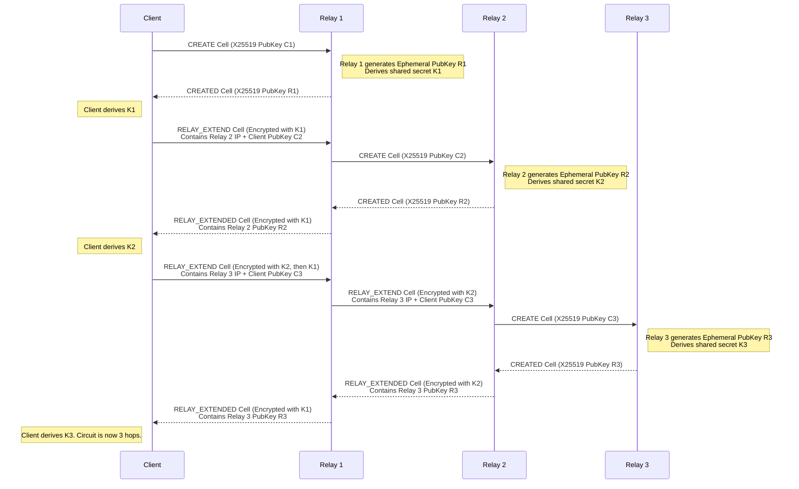

# AnonGuard Circuit Handshake Specification

The AnonGuard network establishes circuits telescopically, hop-by-hop. The handshake relies on X25519 Ephemeral Diffie-Hellman (ECDHE) keys exchanged over the `OnionCell` protocol.

## Cell Layout

All cells are exactly 1024 bytes and follow this layout (after the in-place AEAD migration):

| Offset (Bytes) | Field Name    | Length (Bytes) | Description |
|----------------|---------------|----------------|-------------|
| 0 - 3          | `circuit_id`  | 4              | Unique ID for the circuit multiplexed over the transport layer. |
| 4 - 7          | `sequence_no` | 4              | Anti-replay counter. Handshake cells use `0`. |
| 8              | `command`     | 1              | E.g., `Create` (1), `Created` (2), `Relay` (3), `Extend` (5). |
| 9 - 10         | `stream_id`   | 2              | ID for streams multiplexed within a circuit. `0` for control cells. |
| 11 - 12        | `length`      | 2              | Length of valid payload (up to 995). |
| 13 - 1007      | `payload`     | 995            | Command-specific data. |
| 1008 - 1023    | `mac` (tag)   | 16             | ChaCha20-Poly1305 AEAD Tag. |

## Sequence Diagram: Telescopic Handshake

## Handshake Security Properties
1. **Forward Secrecy**: Handshake relies purely on ephemeral X25519 keypairs. The long-term Ed25519 identity key of the relay is used to sign the consensus, but not for the actual key exchange.
2. **Anti-Replay**: Initial handshakes enforce `sequence_no == 0`. The derived stream keys use explicit nonces constructed from `circuit_id` and the monotonically increasing `sequence_no`.
3. **AEAD Mutual Authentication**: Handshake payloads are unauthenticated during the `CREATE` step, but subsequent `EXTEND` and `DATA` cells are protected by the ChaCha20-Poly1305 AEAD layer using the derived forward and backward keys.
